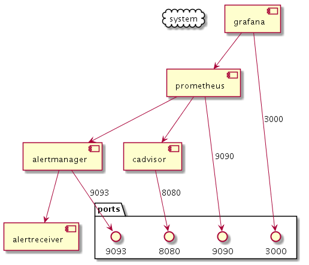

# Study Prometheus Lifecycle

프로메테우스 라이프사이클에 대해 공부해 본다.

## Architecture

프로메테우스 메트릭 시스템을 간단하게 구현하기 위한 서비스 셋을 `docker-compose`를 이용해 구성한다.

### Service Dependencies

``` sh
# draw component dependencies
$ cat docker-compose.yml \
    | docker run --rm -i funkwerk/compose_plantuml \
        --link-graph --boundaries --group \
    | docker run --rm -i think/plantuml -tpng \
    > output.png

$ open output.png
```



### Components

- `alertreceiver`: alertmanager에서 오는 얼럿에 대한 정보를 log로 찍어 보기 위한 Flask API.

## Run

``` sh
# start services
$ docker-compose up -d
```
